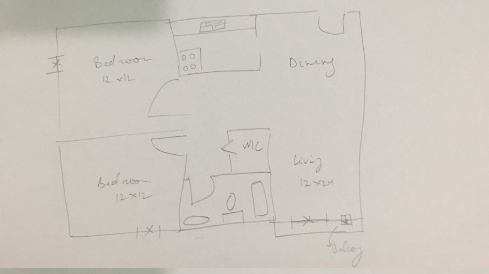
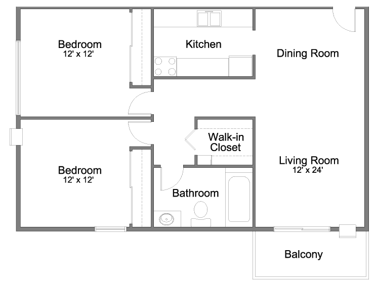

# rough2CAD

> Converting rough hand-drawn images to awesome AutoCad-like floor plans. 

Creating floor plans, though seemingly simplistic, is a very time-consuming and skill-intensive process. For existing properties, the site officer first makes a visit and then gives a rough drawing (with not-to-scale dimensions marked) and/or some explanation to the designer who must convert this information into a floor plan using his CAD skills. Through this project, we aim to reduce the time spent in the process and the requirement of skilled (Auto)CAD designer by directly converting the rough drawing to a floor plan.

## Skills required (or learning outcomes)

- Python
- Image processing (probably using [OpenCV](https://opencv.org/))
- Machine Learning and/or deep learning (potential)
- Programmatically operating AutoCAD (or other similar softwares)

## Expected (sample) Outcome

> input image

 
 

> output image

 
  

## HOW?
<b>Step 1:</b>
Detection of lines and corners  
Resources:
- (http://answers.opencv.org/question/25526/corners-and-lines-detection-in-hand-drawn-pictures-in-python/)
- (https://stacks.stanford.edu/file/druid:cg133bt2261/Ahmed_Wheeler_Generating_PowerPoint_Slides_from_Hand_Drawn_Sketches.pdf)
  
<b>Step 2: </b> Detect other shapes which may/may not represent other features like doors and and windows
I think we should let our algorithm detect such features and ask the user if it represents something. If the user says yes and selects doors(pre-existing set of objects), we will save it and create an SVM for it so that it is easier to detect it later.  
<b>Step 3:</b> What else is left?

## Contribution Requirements

* Knowledge of Python
* Some experience with OpenCV and/or Image Processing is a big plus.

## Authors

* **[Utkarsh Mittal](https://github.com/utkarshmttl)** - *utkarshmttl@gmail.com*

See also the list of [contributors](https://github.com/utkarshmttl/rough2CAD/graphs/contributors) who participated in this project.
